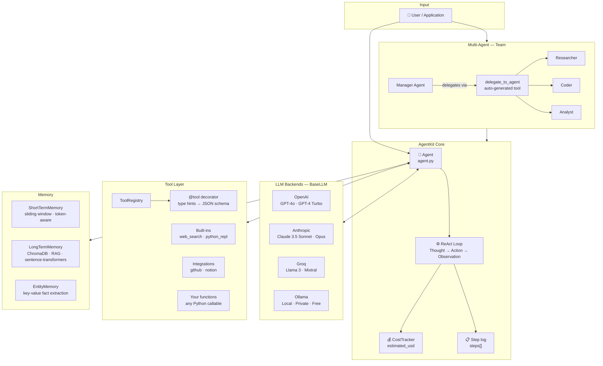
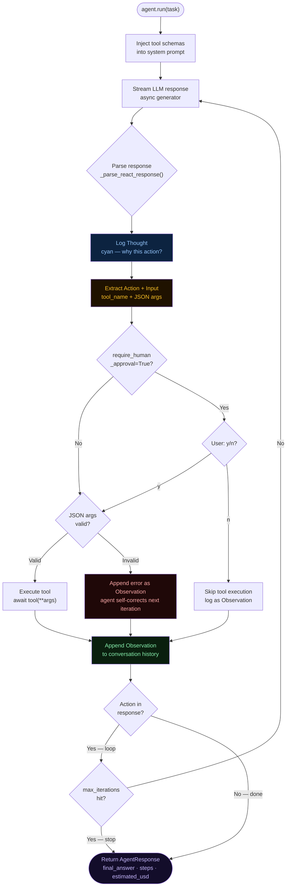
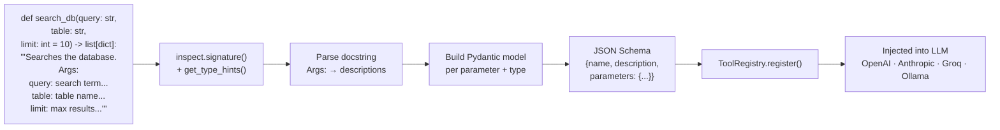
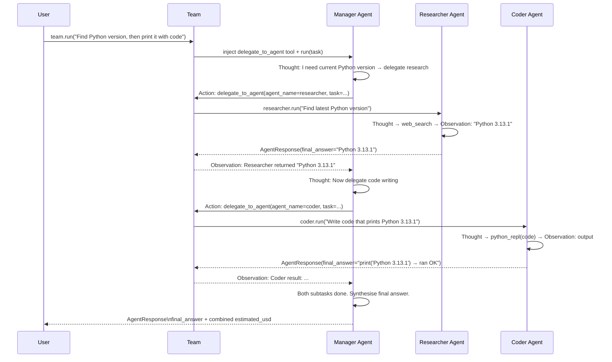
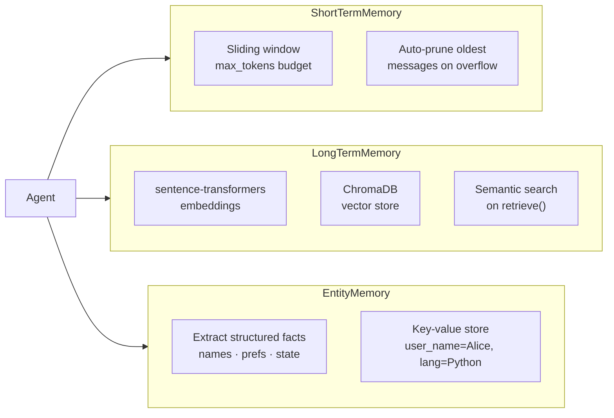

<div align="center">

<br/>

```
 █████╗  ██████╗ ███████╗███╗   ██╗████████╗██╗  ██╗██╗████████╗
██╔══██╗██╔════╝ ██╔════╝████╗  ██║╚══██╔══╝██║ ██╔╝██║╚══██╔══╝
███████║██║  ███╗█████╗  ██╔██╗ ██║   ██║   █████╔╝ ██║   ██║   
██╔══██║██║   ██║██╔══╝  ██║╚██╗██║   ██║   ██╔═██╗ ██║   ██║   
██║  ██║╚██████╔╝███████╗██║ ╚████║   ██║   ██║  ██╗██║   ██║   
╚═╝  ╚═╝ ╚═════╝ ╚══════╝╚═╝  ╚═══╝   ╚═╝   ╚═╝  ╚═╝╚═╝   ╚═╝   
```

### The AI agent framework that shows its work.

*Transparent ReAct loops · Multi-agent orchestration · Zero abstraction tax · Production-ready*

<br/>

[](https://pypi.org/project/agentkit-ai/)
[](https://www.python.org/)
[](https://github.com/agentkit/agentkit/actions)
[](https://codecov.io/gh/agentkit/agentkit)
[](https://openai.com)
[](https://anthropic.com)
[](https://groq.com)
[](https://ollama.com)
[](LICENSE)

<br/>

```bash
pip install agentkit-ai
```

<br/>

[**Quickstart**](#-quickstart-2-minutes) · [**Architecture**](#-architecture) · [**Multi-Agent**](#-multi-agent-orchestration) · [**Tools**](#-the-tool-decorator) · [**Memory**](#-memory-strategies) · [**Docs**](https://docs.agentkit.dev)

<br/>

</div>

---

## What this is

LangChain has 847 classes. AgentKit has one that matters: **`Agent`**.

AgentKit is a production-grade AI agent framework built on a single principle: **you should always know exactly what your agent is doing, why, and what it cost.** Every Thought, every Action, every tool call, every dollar — logged, stored, and accessible.

No hidden magic. No 5-layer abstractions. No framework source code archaeology when something breaks. Just clean Python, Pydantic schemas, and a transparent ReAct loop you can read in an afternoon.

> *"If you can't explain what your agent is doing step by step, you can't fix it when it breaks in production."*

---

## ⚡ At a glance

<div align="center">

| What you want | AgentKit | LangChain |
|---|---|---|
| Debug a failing tool | Read your own function | Trace 5 abstraction layers |
| See what the LLM receives | `agent.steps` — every thought | Add custom callbacks |
| Cost per run | `response.estimated_usd` | Integrate a 3rd-party tool |
| Add a tool | `@tool` on any function | Subclass `BaseTool`, override methods |
| Multi-agent setup | `Team(manager=agent)` | Custom chains + callbacks |
| Switch LLM provider | One import swap | Rewrite your chains |
| Prevent dangerous actions | `require_human_approval=True` | Build your own guardrails |
| Local / private models | `OllamaLLM(model="llama3")` | Separate integration setup |

</div>

---

## 🚀 Quickstart (2 minutes)

```python
import asyncio
from agentkit.agent import Agent
from agentkit.llm.openai import OpenAILLM
from agentkit.tools import ToolRegistry, tool

@tool
def get_weather(city: str, unit: str = "C") -> str:
    """Returns current weather for a city.
    
    Args:
        city: The city name to check weather for.
        unit: Temperature unit, either C or F.
    """
    return f"It's 22{unit} and sunny in {city}."

async def main():
    agent = Agent(
        llm=OpenAILLM(model_name="gpt-4o"),
        tools=ToolRegistry([get_weather]),
        system_prompt="You are a helpful assistant.",
    )

    response = await agent.run("What's the weather like in Istanbul and Tokyo?")
    
    print(response.final_answer)
    # → It's 22C and sunny in both Istanbul and Tokyo!

    # Full execution trace — every step the agent took
    for step in response.steps:
        print(f"[{step.type:12s}] {step.content}")
    # → [thought     ] I need to check weather for both cities.
    # → [action      ] get_weather({"city": "Istanbul", "unit": "C"})
    # → [observation ] It's 22C and sunny in Istanbul.
    # → [action      ] get_weather({"city": "Tokyo", "unit": "C"})
    # → [observation ] It's 22C and sunny in Tokyo.
    # → [answer      ] It's 22C and sunny in both cities!

    print(f"Cost: ${response.estimated_usd:.6f}")
    # → Cost: $0.000312

asyncio.run(main())
```

No chains. No config files. No framework imports beyond `Agent` and `@tool`.

---

## 🏗 Architecture

### Full system overview



---

### The ReAct loop — what actually executes



---

### `@tool` — from Python function to LLM schema



---

### Multi-agent delegation — sequence



---

## 🧰 The `@tool` decorator

Write a normal Python function. AgentKit generates the production-ready LLM schema automatically.

```python
from agentkit.tools import tool

@tool
def search_database(query: str, table: str, limit: int = 10) -> list[dict]:
    """
    Searches the database for records matching a query.

    Args:
        query:  The search term to look for.
        table:  The database table to search in (e.g. 'users', 'orders').
        limit:  Maximum number of results to return. Defaults to 10.
    """
    return db.search(query, table, limit)
```

AgentKit reads your type hints and docstring, marks `query` and `table` as required, `limit` as optional with default `10`, and generates a schema that works identically for OpenAI, Anthropic, Groq, and Ollama — zero changes when switching providers.

**Built-in tools** (`agentkit/tools/builtins.py`): `web_search` · `python_repl` · `file_read` · `shell`

**Integration tools** (`agentkit/tools/integrations/`): `github_get_issue` · `github_create_pr` · `notion_create_page` · `notion_append_block`

---

## 🤝 Multi-agent orchestration

```python
from agentkit.orchestrator import Team

# Specialist agents — each with a focused system prompt + tool set
researcher = Agent(llm=llm, tools=ToolRegistry([web_search]),
                   system_prompt="You find accurate information on the web.")

coder = Agent(llm=llm, tools=ToolRegistry([python_repl]),
              system_prompt="You write clean, tested Python code.")

# Manager gets a `delegate_to_agent` tool injected automatically
manager = Agent(llm=llm, tools=ToolRegistry(),
                system_prompt="You are a lead engineer. Break problems down and delegate.")

team = Team(manager=manager)
team.add_agent("researcher", researcher)
team.add_agent("coder", coder)

response = await team.run(
    "Find the current EUR/USD rate and write a Python function that converts any EUR amount."
)

print(response.final_answer)
print(f"Total cost across all agents: ${response.estimated_usd:.4f}")
```

When you call `team.add_agent(name, agent)`, the `Team` class dynamically creates a `delegate_to_agent(agent_name, task_description)` tool and injects it into the Manager's `ToolRegistry`. The Manager never needs to know the sub-agents exist at instantiation time.

---

## 🧠 Memory strategies



```python
from agentkit.memory import ShortTermMemory, LongTermMemory, EntityMemory

# Token-capped sliding window
Agent(..., memory=ShortTermMemory(max_tokens=4000))

# RAG across sessions — recall any past context by semantic similarity
Agent(..., memory=LongTermMemory(persist_dir="./agent_memory"))

# Extract and persist structured facts from conversation
Agent(..., memory=EntityMemory())
```

---

## 💰 Cost tracking

Every run returns exact cost data — no estimation, no guessing.

```python
response = await agent.run("Summarize this 50-page report.")

print(f"Input tokens:  {response.token_usage.input}")
print(f"Output tokens: {response.token_usage.output}")
print(f"Estimated USD: ${response.estimated_usd:.6f}")

# Bring your own pricing (per million tokens)
llm = OpenAILLM(
    model_name="gpt-4o",
    price_per_m_input=2.50,
    price_per_m_output=10.00,
)
```

Cost is computed from tiktoken + provider-reported usage, accurate even on streamed responses.

---

## 🔒 Human-in-the-loop

```python
agent = Agent(
    llm=llm,
    tools=ToolRegistry([execute_sql, send_email, delete_file]),
    require_human_approval=True,
    approval_tools=["execute_sql", "delete_file"],  # only gate these
)
```

Before any gated tool runs, the loop pauses:

```
┌─────────────────────────────────────────────────────────────────┐
│  ⚠  Agent wants to execute a tool                              │
│                                                                 │
│  Tool:  execute_sql                                             │
│  Input: {"query": "DELETE FROM users WHERE inactive = true"}    │
│                                                                 │
│  Approve? [y/n]:                                                │
└─────────────────────────────────────────────────────────────────┘
```

`n` → logs the skip as an Observation, agent continues reasoning. Never crashes.

---

## 🌐 LLM providers

One interface. Four providers. One import to switch.

```python
from agentkit.llm.openai    import OpenAILLM
from agentkit.llm.anthropic import AnthropicLLM
from agentkit.llm.groq      import GroqLLM
from agentkit.llm.ollama    import OllamaLLM

llm = OpenAILLM(model_name="gpt-4o")
llm = AnthropicLLM(model_name="claude-3-5-sonnet-20241022")
llm = GroqLLM(model_name="llama-3.1-70b-versatile")   # ultra-low latency
llm = OllamaLLM(model_name="llama3.2")                 # local, free, private
```

All implement `BaseLLM` with async streaming. Your tools, memory, and `Team` are provider-agnostic.

---

## 📁 Module anatomy

```
agentkit/
│
├── agent.py              ← Agent · AgentStep · CostTracker · ReAct loop
├── orchestrator.py       ← Team · Manager↔SubAgent · delegate_to_agent injection
├── cli.py                ← Rich terminal UI · run agents from command line
├── __main__.py           ← python -m agentkit entry point
│
├── llm/
│   ├── base.py           ← BaseLLM · LLMChunk · abstract async streaming
│   ├── openai.py         ← OpenAI async/streaming + tiktoken cost
│   ├── anthropic.py      ← Anthropic Claude + usage-header cost
│   ├── groq.py           ← Groq (Llama 3, Mixtral) low-latency
│   └── ollama.py         ← Local Ollama — zero API cost
│
├── memory/
│   ├── short_term.py     ← Sliding window · token budget · auto-prune
│   ├── long_term.py      ← ChromaDB + sentence-transformers · RAG retrieve
│   └── entity.py         ← Extract + persist structured facts from conversation
│
├── tools/
│   ├── base.py           ← ToolRegistry · ToolDefinition · register API
│   ├── decorator.py      ← @tool · type hints + docstring → JSON schema
│   ├── builtins.py       ← web_search · python_repl · file_read · shell
│   └── integrations/
│       ├── github.py     ← get_issue · create_pr · list_prs (PyGithub)
│       └── notion.py     ← create_page · append_block · query_database
│
├── types/
│   └── schemas.py        ← Message · AgentStep · AgentResponse · TokenUsage (Pydantic v2)
│
└── utils/
    └── logging.py        ← Loguru · Thought=cyan · Action=yellow · Observation=green
```

---

## 📦 Installation

```bash
# Core — all LLM providers + built-in tools
pip install agentkit-ai

# With long-term vector memory (ChromaDB + sentence-transformers)
pip install agentkit-ai[memory]

# With GitHub + Notion integrations
pip install agentkit-ai[integrations]

# Everything
pip install agentkit-ai[all]
```

**Python 3.10+ required.**

### Developer setup

```bash
git clone https://github.com/agentkit/agentkit.git
cd agentkit
poetry install --all-extras
poetry run pre-commit install
poetry run pytest --cov=agentkit tests/
```

---

## 💡 Examples

| Example | What it demonstrates |
|---|---|
| [`examples/quickstart.py`](examples/quickstart.py) | Single agent · `@tool` · cost tracking |
| [`examples/multi_agent_team.py`](examples/multi_agent_team.py) | Manager + researcher + coder |
| [`examples/long_term_memory.py`](examples/long_term_memory.py) | ChromaDB RAG across sessions |
| [`examples/human_in_loop.py`](examples/human_in_loop.py) | Approval gates for destructive tools |
| [`examples/local_llm_ollama.py`](examples/local_llm_ollama.py) | Fully local setup, no API key |
| [`examples/github_agent.py`](examples/github_agent.py) | Agent that reads and triages GitHub issues |
| [`examples/cost_benchmarks.py`](examples/cost_benchmarks.py) | Provider cost comparison for same task |

---

## 🗺 Roadmap

- [x] Transparent ReAct loop with full step logging
- [x] `@tool` — type hints + docstring → JSON schema, all providers
- [x] `Team` with automatic `delegate_to_agent` injection
- [x] Short-term · Long-term (RAG) · Entity memory
- [x] Built-in cost tracking per run
- [x] Human-in-the-loop approval gates
- [x] OpenAI · Anthropic · Groq · Ollama
- [x] GitHub + Notion integrations
- [x] Rich CLI (`python -m agentkit`)
- [ ] Parallel tool fan-out (concurrent tools in one ReAct step)
- [ ] Agent checkpointing — resume long-running tasks after interruption
- [ ] Step-by-step execution web UI
- [ ] LangSmith / Langfuse observability integration
- [ ] `agentkit deploy` — one-command agent API server

---

## 🤝 Contributing

Issues and PRs are welcome. For large changes, open an issue first.

```bash
git clone https://github.com/agentkit/agentkit.git && cd agentkit
poetry install --all-extras && poetry run pre-commit install
poetry run pytest --cov=agentkit tests/   # run tests
poetry run ruff check agentkit/           # lint
poetry run mypy agentkit/                 # type-check
```

---

## 📄 License

MIT © [AgentKit Contributors](https://github.com/agentkit/agentkit/graphs/contributors)

---

<div align="center">

*Built out of genuine frustration with opaque agent frameworks.*

*If AgentKit saved you hours of debugging, a* ⭐ *means the world.*

</div>
